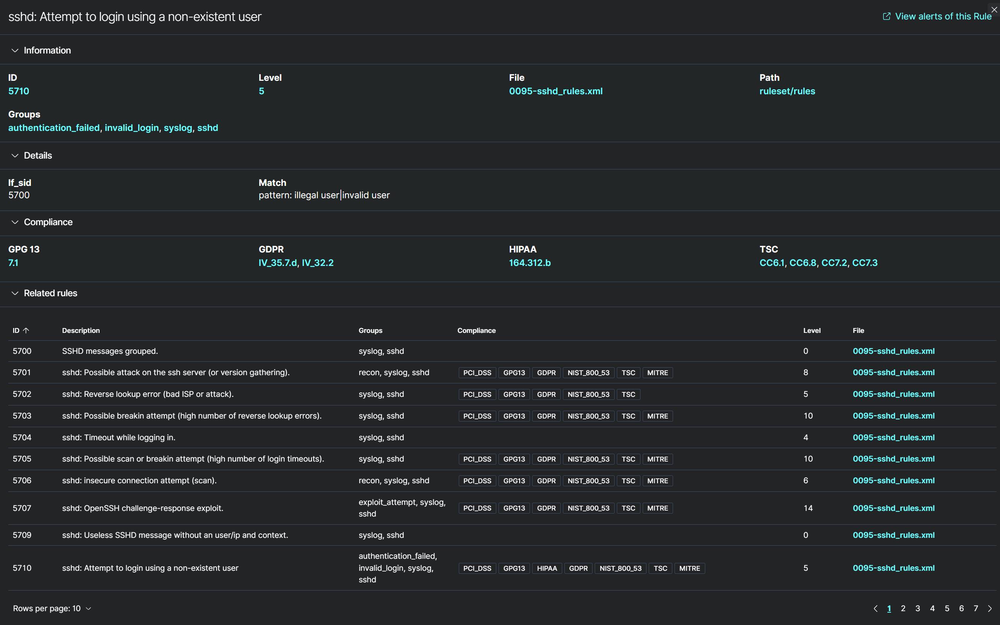
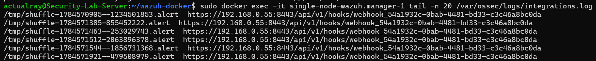
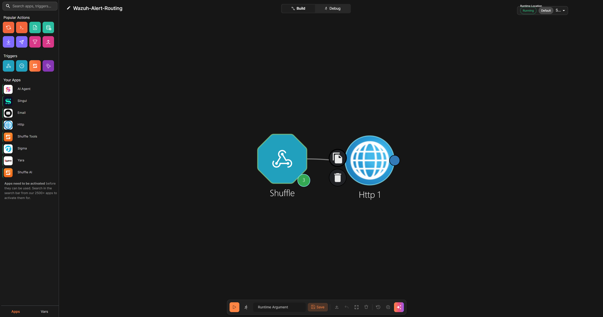
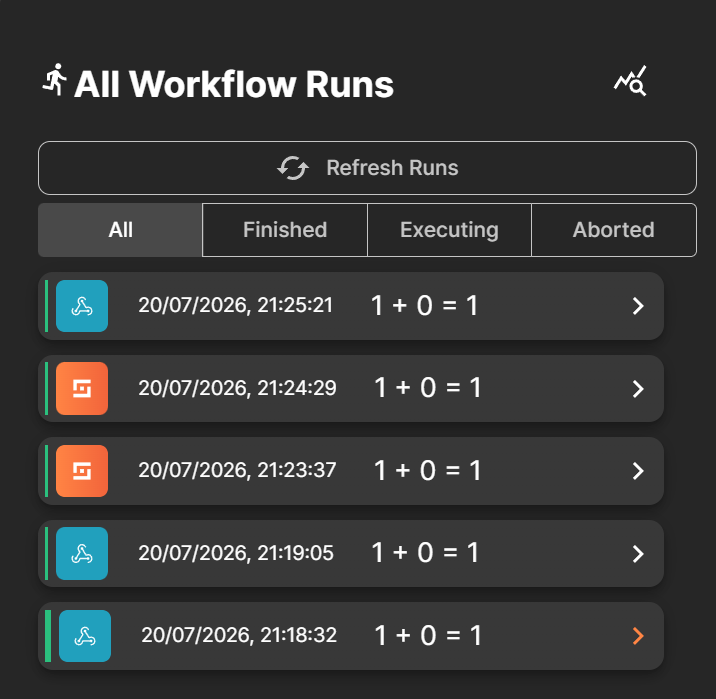
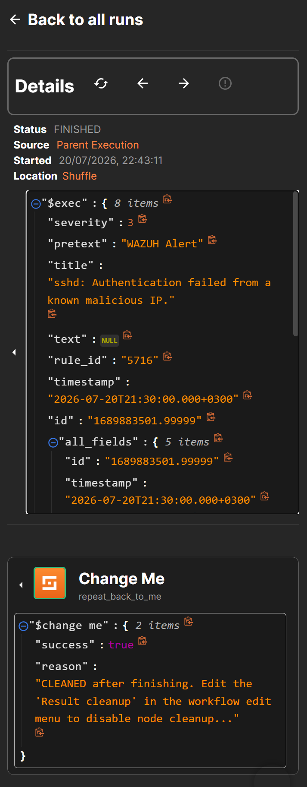

# Wazuh SIEM to Shuffle SOAR Automation Pipeline

## What is this project?
- This is a hands-on practical security automation project. The goal was to eliminate manual security alerts and build a closed-loop system, where a SIEM detects a threat and SOAR platform acts immediately to investigate.

- I span up a Dockerized Wazuh Manager to monitor system logs, hooked it directly to a local Shuffle SOAR instance via webhooks, and built an automated threat intelligence pipeline that pulls out malicious IPs and enriches them with real-world geographical and network data in real time.

## The Tech Stack
* **SIEM:** Wazuh Manager (Single-node Docker deployment on Ubuntu 24.04)
* **SOAR:** Shuffle (Local Docker deployment)
* **Languages & Tools:** Python, Bash, Docker, Git, REST APIs

## Real-World Problems I Ran Into (and Fixed)
While working on building the system in the local lab environment, there were a few problems that I faced and required me to dive into the backend integration code to fix them:

### 1. The SSL Handshake Failure (`SSLError`)
- The Problem: my local instance of Shuffle has self-signed certificates, so Wazuh's native python integration script (shuffle.py) simply refused to connect, with a CERTIFICATE_VERIFY_FAILED error.
- The Solution: I patched the container's native `shuffle.py` script at line 229 to add a `verify=False` parameter to the Python `requests` call.
This bypassed the strict local SSL restriction and managed to open the data pipe.

### 2. No ID for Alert (KeyError: 'id')
- The Problem: While testing out the integration on custom alerts' mockup, Shuffle dropped payloads, and the Wazuh logs revealed the presence of Python KeyError 'id'. A very strict JSON format with a top-level field that uniquely identifies the alert is required by the script for the integration, which is not present in the logs manually created.
- The Solution: I structured one-line JSON mock alert template that was developed to match the data schema requirements in the script, which allowed the logs to be processed and exit with code 0.

## How the Automation Works
1. **Detection:** An event causes the generation of an alert in Wazuh (e.g., simulation of a brute force SSH attack).

2. **Forwarding:** An alert is picked up by the integrated engine of Wazuh and automatically transmits the entire JSON payload to the Shuffle webhook URL.

3. **Parsing & Extraction:** The (`srcip`), which is the attacker's source IP, gets extracted by Shuffle from the JSON alert embedded in the payload.

4. **Enrichment:** Shuffle dynamically gets that extracted IP address, queries the external intelligence API, and receives all the context information about the attacker, such as the location (country, city, and ISP).

